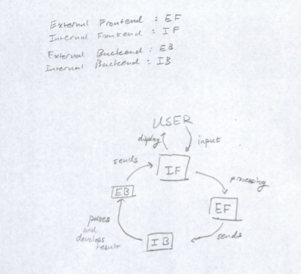

## Introduction

Our group is trying to develop an integrated development environment that supports the Slogo programming language. This IDE is run on an interactive per expression basis, or a read-eval-print loop for interpreted languages. Our primary design goal is to develop four different APIs that are easy to learn, use, read, maintain, and also powerful enough to satisfy the requirements of our program. Our program will be flexible on the front end, allowing users to change their view, and on the background making it easy for users to add more features in the future. Editing the front end to include different buttons/features will be open, and proper use of interface design will encourage such implementations. The interpreter will remain closed to changes; however, will be open to the addition of new commands. 

## Design Overview

**Internal Front-end API:**
+ Image View
+ Text Field
+ Button

The internal front-end API constructs the graphical user interface of a program. It creates buttons and listens to user input events. This api also contains a text field for the user to input commands and displays errors. There is a WindowView class which acts as the container for the TextField, MenuBar, Console, and ImageView classes. The TextField class shows the history of the user input represented as a list of string, and allows the user to access the history similar as with the command prompt. The most crucial part of the TextField class will have to be the ability to take in a user text input. The MenuBar class acts as the container for all the buttons and remains fixed at the top of the JavaFX application window. The MenuBar may be replaced by an HBox or contain an HBox as the main structure of it. The Buttons class may be an override of the traditional Java Button class with additional features such as responsive to size changes. The Console class will exist to show the user errors from their input. There will also be a feature to hide/show the Console class as it is not a crucial part of the IDE. The ImageView class will represent the plot where the turtle graphics are displayed. There will also be an updateView method that will update the image after every valid user input. 

**External Front-end API:**
+ User input
+ Button/or other events (ones that are not handled by the front end)

Communicating user input, button events depending on how the specific language is going to be implemented. There will be a UserInput class that will acquire all text inputs from the user. If there are any buttons that require the backend to implement the UserInput class will transfer the appropriate information to the backend. 

**Internal Back-end API:**
+ Parsing command
+ User input events
+ Turtle graphics package

Parses the user input and implements button commands. Implements changes to the graphical interface. There will be a Parser class that will hold the actual algorithm related to parsing SLogo inputs, this class will return an instance of one of the Command classes. It is still unclear if all possible commands will be represented in the Parser class or in a different holding, more passive class. Regardless there will be SimpleCommand and Command classes. The SimpleCommand class will be represented by a string and some sort of data point, prospectively an integer value. This will represent a command such as "Forward", 60 -- meaning moving the turtle forward by 60 pixels. The Command class will be used for more complex commands such as for loops, etc. There will be a List of SimpleCommands which is the inherent structure behind more complex commands. In both types of Command classes there will a getResult method which can be applied properly to an image. 

**External Back-end API:**
+ Changes in graphic
+ Error checking/other important alerts

Sends errors received from the internal back-end up to the front-end which are properly displayed there. Sends changes in graphics to the front end. There will be a Result class which can take in a Command class and apply these changes to an image which is the image that will be used to pass to the frontend in ImageView. The external backend will also contain the ErrorSender class which will be able to send errors to the frontend to be displayed by the Console class. 

**Related Components:**

## User Interface

## API Details

* **public interface InternalFrontEnd {**
    * public class WindowView {
        * Container for the TextField, MenuBar, Console, and ImageView classes
    * public class TextField {
        * Shows the history of the user input represented as a list of string, and allows the user to access the history similar as with the command prompt. The most crucial part of the TextField class will have to be the ability to take in a user text input
    * public class MenuBar {
 		* Acts as the container for all the buttons and remains fixed at the top of the JavaFX application window)
    * public class Buttons {
    	* May be an override of the traditional Java Button class with additional features such as responsive to size changes)
    * public class Console {
        * Will exist to show the user errors from their input. There will also be a feature to hide/show the Console class as it is not a crucial part of the IDE
    * public class ImageView {
        * Will represent the plot where the turtle graphics are displayed
    * public class updateView 
        * Method that will update the image after every valid user input)

    * How API supports features of project:
    * What resources API uses:
    * How API is intended to be used:
    * How API could be extended to include additional requirements: 
    * Errors intended to throw:

* **public interface ExternalFrontEnd {**
	* public class UserInput {
        *Will acquire all text inputs from the user, if there are any buttons that require the backend to implement the UserInput class will transfer the appropriate information to the backend)

    * How API supports features of project:
    * What resources API uses:
    * How API is intended to be used:
    * How API could be extended to include additional requirements: 
    * Errors intended to throw:

* **public interface InternalBackEnd {**
	* public class Parser {
        * Will hold the actual algorithm related to parsing SLogo inputs, this class will return an instance of one of the Command classes
	* public class SimpleCommand {
        * Will be represented by a string and some sort of data point, prospectively an integer value. This will represent a command such as "Forward", 60 -- meaning moving the turtle forward by 60 pixels
	* public class Command {
        * Will be used for more complex commands such as for loops, etc

    * How API supports features of project:
    * What resources API uses:
    * How API is intended to be used:
    * How API could be extended to include additional requirements:
    * Errors intended to throw:

* **public interface ExternalBackEnd {**
	* public class Result {
        * Will take in a Command class and apply these changes to an image which will be used to pass to the frontend in ImageView
	* public class ErrorSender {
        *Will be able to send errors to the frontend to be displayed by the Console class

    * How API supports features of project:
    * What resources API uses:
    * How API is intended to be used:
    * How API could be extended to include additional requirements: 
    * Errors intended to throw:

## API Example Code
 * fd 100: forward 100 pixels
 * bd 100: backward 100 pixels
 * lt 90: left-turn 90 degrees
 * rt 90: right-turn 90 degrees
 * du: drawer unabled
 * da: drawer abled
 * ht: hide turtle
 * st: show turtle
 * clear: reset the window
 * home: turtle go to default place, without clearing existing paint
 * repeat (PROCEDURE)/5: repeat the procedure 5 times
 * setX, setY: set the position of the turtle, right and up positive
 * setAngle: set the angle of the turtle, horizontal right as zero and counterclockwise as positive
 * polygon 3: an quilateral triangle, with the first edge drawn towards the current direction of the turtle and following edges going counterclockwise
 * polygon 10000: a circle instead of a 10000-edge polygon
 * polygon 6/2: half of a hexagon
 * [1+1]: arithmetic in [] will be calculated first
 * polygon [6/2]: an quilateral triangle
 * save example.txt: save all commands used to generate current graph to a .txt file
 * saveGraph example.jpg: save the current graph into a .jpg file
 * load example.txt: load the .txt file to generate a graph
 * load example.jpg: load the graph

## Design Considerations

We discussed the pros and cons of where the logic for the commands, buttons, and updating the picture will be located. We deemed that the logic should entirely appear in the backend. This maintains a cleaner separation between the two subsections of the program. The front is solely responsible for display purposes and the backend is responsible for parsing through logic and changes that occur from user input. We discussed how complex animations will represent an ambiguity, and tried to design for such complex program inputs with the Command and SimpleCommand classes. The two external APIs are entirely dependent on their respective internal APIs. Their functionality is dependent on the existence and behaviors of the internal APIs. This dependency may get cleared up in the future but for now remains a problem. 

## Team Responsibilities

Jing
Primary - Parsing
Secondary - Error checking

Erik 
Primary - Compiling commands into image
Secondary - other backend as necessary

Kelley
Primary - text field, image view
Secondary - external api

Dorian
Primary - Menu Bar, Console
Secondary - frontend external api, debugging
